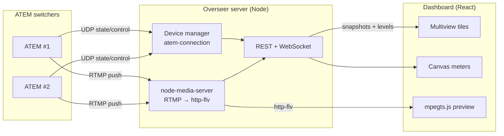

# Atem Overseer

> **AI-assisted project.** This codebase was created with [Claude Code](https://claude.com/claude-code)
> (Anthropic), directed and reviewed by a human author. It was developed and
> verified end-to-end against a built-in simulated switcher fleet (`--mock`), and
> has since been **tested against real ATEM hardware in a lab** — but **never on a
> live show**. Validate transport, streaming and media-upload behaviour against
> your own switchers before relying on it for one.

A browser-based dashboard for monitoring — and controlling — a fleet of
Blackmagic ATEM switchers from one screen, styled after Blackmagic's own
multiviewer.

[](https://www.youtube.com/watch?v=zY5R1NHSDAk)

*A 39-second tour, driven over the app's own HTTP API. The three switchers are the
built-in `--mock` fleet, so their record/stream state is simulated — but the picture in
the tiles is not: real test-pattern streams were pushed into the app's RTMP ingest, and
what you see is the app receiving them.*


*The dashboard running the built-in `--mock` fleet: one tile per switcher with
record/stream status, live program-audio meters, drive time-remaining, ISO/PGM
mode and transport controls.*

**Click around it yourself: <https://atem-overseer-demo.stoatworks-labs.com>** — the
real dashboard in your browser, replaying recorded telemetry from the `--mock`
fleet, so the meters move and the timecode advances. Transport controls are
inert there and say so; the server has to be on the network with your switchers
to control anything. See [demo/README.md](demo/README.md).



Point it at any number of ATEMs on your network and get, per device:

- **Record & stream status** with live timecode and a tally-red tile border when rolling
- **Drive capacity / estimated time remaining** per disk, with working-set and low/critical warnings
- **ISO vs PGM-only** record-mode indicator (and toggle)
- **Stereo program audio metering** (Fairlight levels, peak-hold) that runs at display rate
- **Live output preview** — the ATEM streams to Overseer's bundled RTMP ingest and plays back in the tile with no transcode
- **Per-device audio monitoring** you can mute/un-mute independently, so you listen to one wall at a time
- **Remote transport** — start/stop record and stream from the browser

From the top-bar **Devices** button — fleet management (see [docs/device-management.md](docs/device-management.md)):

- **Best-effort mDNS discovery** of ATEMs on the network, plus **manual add** by IP or hostname
- **Add / remove** devices from the dashboard live (persisted to the config file)
- Per-device info — model, IP, reverse-DNS hostname, record name, protocol version
- One-click **launch of ATEM Software Control, ATEM Setup, MixEffect or ATEM Fleet Manager**, targeting the device where a mechanism exists (MixEffect URL scheme; commands are configurable) and copying the IP to the clipboard otherwise

Behind each tile's ⚙ (gear):

- **Streaming.xml generator** — drop it into ATEM Software Control (or apply the service to a switcher directly) so the ATEM streams to Overseer
- **Restreamer split pipeline** (optional) — stream the ATEM to a [Restreamer](https://datarhei.com/restreamer) instead, which copies one feed back to Overseer for preview and fans the rest out to YouTube/Twitch/etc., managed per-device. See [docs/restreamer.md](docs/restreamer.md). Built as a portable `@av/restreamer` package so [flock](https://github.com/stoatworks-labs/flock) can reuse it.
- **Config XML save / load** for the monitored fleet
- **Media pool upload** (any image, converted to the switcher's native RGBA in-browser) and **media-player assignment**

---

<!-- downloads:start -->

## Download

**[v0.3.0](https://github.com/stoatworks-labs/atem-overseer/releases/tag/v0.3.0)** — prebuilt for macOS, Windows and Linux. Pick your platform:

<details>
<summary><b>macOS</b> — Apple Silicon, Intel</summary>

| Build | Download | Size |
| --- | --- | --- |
| Apple Silicon · .dmg disk image | [`Atem.Overseer_0.3.0_aarch64.dmg`](https://github.com/stoatworks-labs/atem-overseer/releases/download/v0.3.0/Atem.Overseer_0.3.0_aarch64.dmg) | 48 MB |
| Intel · .dmg disk image | [`Atem.Overseer_0.3.0_x64.dmg`](https://github.com/stoatworks-labs/atem-overseer/releases/download/v0.3.0/Atem.Overseer_0.3.0_x64.dmg) | 50 MB |
| Apple Silicon · .pkg installer | [`atem-overseer-0.3.0-macos-aarch64.pkg`](https://github.com/stoatworks-labs/atem-overseer/releases/download/v0.3.0/atem-overseer-0.3.0-macos-aarch64.pkg) | 48 MB |
| Intel · .pkg installer | [`atem-overseer-0.3.0-macos-x86_64.pkg`](https://github.com/stoatworks-labs/atem-overseer/releases/download/v0.3.0/atem-overseer-0.3.0-macos-x86_64.pkg) | 50 MB |

</details>

<details>
<summary><b>Windows</b> — x64</summary>

| Build | Download | Size |
| --- | --- | --- |
| x64 · .exe installer | [`Atem.Overseer_0.3.0_x64-setup.exe`](https://github.com/stoatworks-labs/atem-overseer/releases/download/v0.3.0/Atem.Overseer_0.3.0_x64-setup.exe) | 30 MB |

</details>

<details>
<summary><b>Linux</b> — x64</summary>

| Build | Download | Size |
| --- | --- | --- |
| x64 · .deb package (Debian/Ubuntu) | [`Atem.Overseer_0.3.0_amd64.deb`](https://github.com/stoatworks-labs/atem-overseer/releases/download/v0.3.0/Atem.Overseer_0.3.0_amd64.deb) | 57 MB |
| x64 · .rpm package (Fedora/RHEL) | [`Atem.Overseer-0.3.0-1.x86_64.rpm`](https://github.com/stoatworks-labs/atem-overseer/releases/download/v0.3.0/Atem.Overseer-0.3.0-1.x86_64.rpm) | 58 MB |

</details>

Also in this release:

- [`atem-overseer-node-bundle.tar.gz`](https://github.com/stoatworks-labs/atem-overseer/releases/latest/download/atem-overseer-node-bundle.tar.gz) — Node bundle (run it yourself), 235 KB

All builds, checksums and release notes: [github.com/stoatworks-labs/atem-overseer/releases](https://github.com/stoatworks-labs/atem-overseer/releases).

The Windows builds are unsigned, so SmartScreen warns once — see [Windows SmartScreen & Defender Firewall](#windows-smartscreen--defender-firewall) for the one-time click-through.

<!-- downloads:end -->

## Architecture

```
 ATEM switchers ──UDP(atem-connection)──┐
        │                               │
        └──RTMP push (Streaming.xml)──┐ │
                                      ▼ ▼
                            ┌───────────────────────┐
                            │   Overseer server     │
                            │  • device manager     │
                            │  • node-media-server  │  RTMP:1935  →  http-flv:8000
                            │  • REST + WebSocket    │
                            └───────────┬───────────┘
                                        │  WS: snapshots + batched audio levels
                                        ▼
                            ┌───────────────────────┐
                            │  Web dashboard (React) │  mpegts.js plays the http-flv feed
                            │  BMD multiview tiles   │  canvas meters @ display rate
                            └───────────────────────┘
```

- **`packages/server`** — Node + TypeScript. Wraps [`atem-connection`](https://www.npmjs.com/package/atem-connection) for each device, normalizes state into a UI-friendly model, and fans it out over WebSocket. Bundles [`node-media-server`](https://www.npmjs.com/package/node-media-server) so each switcher's RTMP stream is re-served as low-latency http-flv. REST for commands, config, and media upload.
- **`packages/web`** — Vite + React + TypeScript. The multiview dashboard; [`mpegts.js`](https://www.npmjs.com/package/mpegts.js) for playback.

The stream key **is** the device id — that's how a published RTMP stream is matched to its tile.

## Quick start

```bash
npm install

# no hardware? run the simulated 3-switcher fleet:
npm run dev:mock          # dashboard at http://localhost:4700

# real devices — copy the example, edit addresses, then:
cp atem-overseer.config.example.json atem-overseer.config.json
npm run build
npm start
```

Set `publicHost` to the IP the ATEMs (and browsers) reach this machine at — it's
baked into the generated `Streaming.xml` and the http-flv playback URLs.

### Wiring up live preview

1. Open a tile's ⚙ → **Download Streaming.xml**, and place it in ATEM Software
   Control's streaming support folder (or hit **Apply local service to switcher**
   to push the RTMP URL directly over the protocol).
2. Set the switcher's stream key to its Overseer device id (listed in the XML).
3. Start streaming — the feed appears in the tile.

## Desktop app

Prefer a one-click app over `npm`? The [`launcher/`](launcher/) directory wraps
Overseer in the fleet's [av-launcher](https://github.com/stoatworks-labs/av-launcher)
tray shell — a small native menu-bar app (Tauri v2) that embeds a Node runtime
and the whole app, so nothing needs to be installed. Pick an interface + port,
Start/Stop, and open the dashboard from the system tray. Download an installer
from [Releases](https://github.com/stoatworks-labs/atem-overseer/releases), or see
[`launcher/README.md`](launcher/README.md) to build one.

## Ports

| Port | Purpose |
| ---- | ------- |
| 4700 | Dashboard + REST + WebSocket |
| 1935 | RTMP ingest (`rtmp://<host>:1935/live/<deviceId>`) |
| 8000 | http-flv playback (`http://<host>:8000/live/<deviceId>.flv`) |

## Documentation

| Doc | Contents |
|---|---|
| [docs/USER-GUIDE.md](docs/USER-GUIDE.md) | Reading a tile, transport controls, live preview, troubleshooting |
| [docs/API.md](docs/API.md) | REST routes, the WebSocket protocol, snapshot fields, config schema, XML formats |
| [docs/DEVELOPING.md](docs/DEVELOPING.md) | Monorepo build order, the mock-first rule, server internals |
| [docs/device-management.md](docs/device-management.md) | Discovery, adding devices, external-app launch |
| [docs/streaming-setup.md](docs/streaming-setup.md) | Getting live preview working end to end |
| [docs/restreamer.md](docs/restreamer.md) | The optional split pipeline |
| [docs/diagnostics.md](docs/diagnostics.md) | Where the logs are, what a crash report contains, and how to send one file that explains a fault |

## Scope & honest caveats

- **Metering is telemetry, always shown.** The per-tile mute only silences the
  browser's local audio playback of that stream — it never affects the meter or
  the switcher.
- **"Drive capacity"** comes from the ATEM as *recording time available*, not raw
  bytes (the protocol doesn't expose capacity); the bar uses 4h as a nominal
  "full" reference.
- **Config XML** here is Overseer's own fleet/ingest config, not a full ATEM
  state backup. Device-list changes take effect on restart.
- **No authentication, and the server binds to every interface.** Anyone who can reach port
  4700 can start/stop recording and streaming on your switchers. There is no token, session or
  TLS option — run it on a private production network only.
- Developed and verified end-to-end against the built-in `--mock` fleet, and since
  tested against real ATEM hardware in a lab — but never on a live show. Validate
  transport/upload behaviour against your specific ATEM model before relying on
  it live.

## Windows SmartScreen & Defender Firewall

macOS builds are **Developer ID-signed and notarised by Apple** — they open
normally, with no Gatekeeper warning and no quarantine step. The Windows
binaries are **not** code-signed, so Windows still warns you the first time.

- **Windows** — SmartScreen shows *"Windows protected your PC"* →
  **More info** → **Run anyway**.
- **Windows Defender Firewall** — first launch pops *"Allow Atem Overseer to communicate
  on these networks"*. Tick **Private** (and **Domain** on a managed network) — Atem
  Overseer needs it to serve the dashboard and poll ATEM switchers on the LAN. Deny it
  and switchers stay greyed out and the dashboard won't load from another machine.
- **Linux** — no signing gate.

Per-artifact steps, self-signing, checksum verification and the Defender Firewall reset
procedure: **[docs/UNSIGNED.md](docs/UNSIGNED.md)**.

## Control it from Companion

[**companion-module-atem-overseer**](https://github.com/stoatworks-labs/companion-module-atem-overseer) is a [Bitfocus Companion](https://bitfocus.io/companion) connection module for this app.

Record and stream per switcher **and across the whole fleet**, PGM/ISO mode,
monitor mute and restreamer channels, with a preset section generated per
switcher.

The button worth putting in front of an operator is **ALL rolling** — every
*connected* switcher recording. "Something is recording" is true when three of
four machines are rolling, which is the failure an ISO shoot cannot recover
from.

It is not in the official Companion module store — install it via
**Settings → Developer modules path**.

## License

MIT

<!-- attributions:start -->
This project is built on other people's work — see [ATTRIBUTIONS.md](ATTRIBUTIONS.md).
<!-- attributions:end -->
